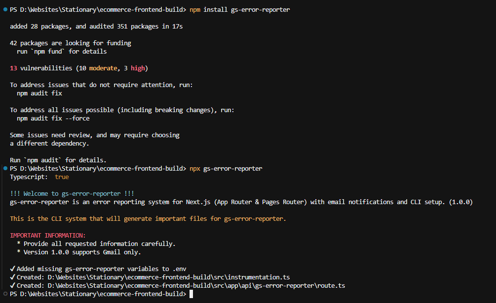
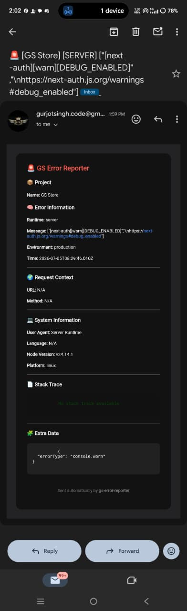
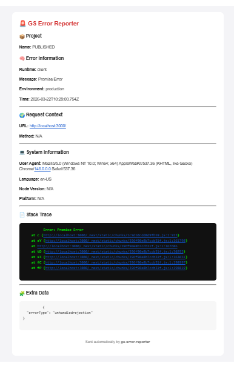

# GS Error Reporter

> Lightweight email-first error monitoring for Next.js.
>
> Capture client and server runtime errors and receive structured and formatted email reports in minutes.

<p align="center">
  <!-- Badges -->
  
  
  
  
</p>

<p align="center">
  <a href="https://gs-error-reporter.vercel.app/docs">Documentation</a> •
  <a href="https://gs-error-reporter.vercel.app/">Website</a> •
  <a href="https://github.com/GS-719/gs-error-reporter/issues/new">Report Bug</a>
</p>

---

# 📸 Preview

### CLI Setup



### Email Report






---

# Why GS Error Reporter?

Most small and medium Next.js projects don't need expensive monitoring platforms or complex dashboards.

GS Error Reporter focuses on one thing:

> Receive detailed error reports directly in your inbox with almost no setup.

No dashboards.

No external monitoring service.

No monthly subscription.

Just install, configure, and receive detailed reports whenever something goes wrong.

---

# Features

## Error Monitoring

- ✅ Client-side runtime errors
- ✅ Server-side runtime errors
- ✅ Unhandled Promise Rejections
- ✅ Console Errors
- ✅ Console Warnings

## Reporting

- ✅ Structured HTML email reports
- ✅ Stack traces
- ✅ Request information
- ✅ Environment details
- ✅ Browser information
- ✅ Additional metadata

## Developer Experience

- ✅ One CLI setup
- ✅ Automatic file generation
- ✅ Supports App Router
- ✅ Supports Pages Router
- ✅ TypeScript support

---

# Why choose GS Error Reporter?

| Feature | GS Error Reporter | Manual Logging |
|----------|-------------------|----------------|
| Email Alerts | ✅ | ❌ |
| Auto Setup | ✅ | ❌ |
| Stack Trace | ✅ | ⚠️ |
| Request Context | ✅ | ❌ |
| HTML Reports | ✅ | ❌ |
| Zero Dashboard | ✅ | ❌ |

---

# Quick Start

## 1. Install

```bash
npm install gs-error-reporter
```

or

```bash
pnpm add gs-error-reporter
```

or

```bash
yarn add gs-error-reporter
```

---

## 2. Run Setup

```bash
npx gs-error-reporter
```

Example output:

```text
✔ Next.js project detected

✔ App Router detected

✔ Created instrumentation.ts

✔ Created API route

✔ Updated environment variables

✔ Setup complete
```

---

## 3. Add GSReporter

### App Router

```tsx
import { GSReporter } from "gs-error-reporter";

export default function RootLayout({ children }) {
  return (
    <html lang="en">
      <GSReporter />
      <body>{children}</body>
    </html>
  );
}

```

### Pages Router

```tsx
import "@/styles/globals.css";
import type { AppProps } from "next/app";
import { GSReporter } from "gs-error-reporter";                                  // import GSReporter into layout.tsx

export default function App({ Component, pageProps }: AppProps) {
  return (
    <>
      <GSReporter />                                                             // Initialize GSReporter 
      <Component {...pageProps} />;
    </>
  )
}

```

---

## 4. Done 🎉

Throw an error.

Receive an email.

---

# Environment Variables

| Variable | Required | Description |
|----------|----------|-------------|
| GS_REPORTER_EMAIL | ✅ | Gmail account used to send reports |
| GS_REPORTER_APP_PASSWORD | ✅ | Gmail App Password |
| GS_REPORTER_RECEIVER | ✅ | Email that receives reports |
| BASE_URL | ✅ | Project URL |
| PROJECT_NAME | ✅ | Project name displayed in reports |

---

# Email Report

Every report contains:

## Project

- Project Name

## Error

- Runtime
- Error Message
- Environment
- Timestamp

## Request

- URL
- Method

## System

- User Agent
- Browser
- Platform
- Node Version
- Language

## Debugging

- Stack Trace
- Additional Data

Include screenshot here.

---

# How It Works

```text
Application

        │

        ▼

 GSReporter

        │

        ▼

 API Route

        │

        ▼

 Nodemailer

        │

        ▼

 Gmail SMTP

        │

        ▼

 Your Inbox
```

---

# CLI

> CLI makes the installation too easy for anyone.

- Project Detection
       
      The CLI automatically detects the type of Next.js project you're using (App Router, Pages Router, or Hybrid)

- Generate Files
      
      The CLI can generate important files for the error monitoring system to work properly.

---

# Generated Files

## App router
```text
app/api/gs-error-reporter/route.ts/js     (TypeScript / JavaScript)

instrumentation.ts/js                     (TypeScript / JavaScript)

.env
```

> The app/api/gs-error-reporter/route.ts file sends the email to the SMTP server (Email service) you are using.
> instrumentation.ts file is used to initialize the server error monitoring
> The .env file is used to store environment variables necessary for the error monitoring and your own project. 

## Pages Router
```text
pages/api/gs-error-reporter.ts/js         (TypeScript / JavaScript)

instrumentation.ts/js                     (TypeScript / JavaScript)

.env
```

> The pages/api/gs-error-reporter.ts file sends the email to the SMTP server (Email service) you are using.
> instrumentation.ts file is used to initialize the server error monitoring
> The .env file is used to store environment variables necessary for the error monitoring and your own project.

---

# Configuration

Once the CLI created all the files, next you just impliment <GSReporter> into you layout.ts/_app.ts     [App Router / Pages Router]

---

# Supported Environments

| Platform | Supported |
|-----------|-----------|
| Next.js 13 | ✅ |
| Next.js 14 | ✅ |
| Next.js 15 | ✅ |
| App Router | ✅ |
| Pages Router | ✅ |
| Node Runtime | ✅ |
| Edge Runtime | ❌ |

---

# Performance

- No database
- No background workers
- Lightweight
- Lightning fast
- Minimal runtime overhead

---

# Security

- SMTP credentials never leave your server. 
- No third-party monitoring service.
- Emails are sent directly through your configured SMTP server.

---

# Current Limitations

- Gmail SMTP only
- Node runtime only
- No dashboard
- No analytics

---

# Roadmap

## Current

- Email reporting
- CLI
- App Router support
- Pages Router support

## Planned

- Multiple SMTP providers
- Multiple frameworks
- Custom templates
- Attachments
- Web dashboard
- Better CLI

---

# Troubleshooting

## Email not sending

Possible causes:

- Wrong App Password
- Invalid receiver email
- SMTP blocked
- BASE_URL incorrect

---

# License

MIT License

---

# Support

If you find a bug:

- Open an issue
- Start a discussion
- Submit a pull request

---

# Acknowledgements

Thank everyone who contributed to the project.